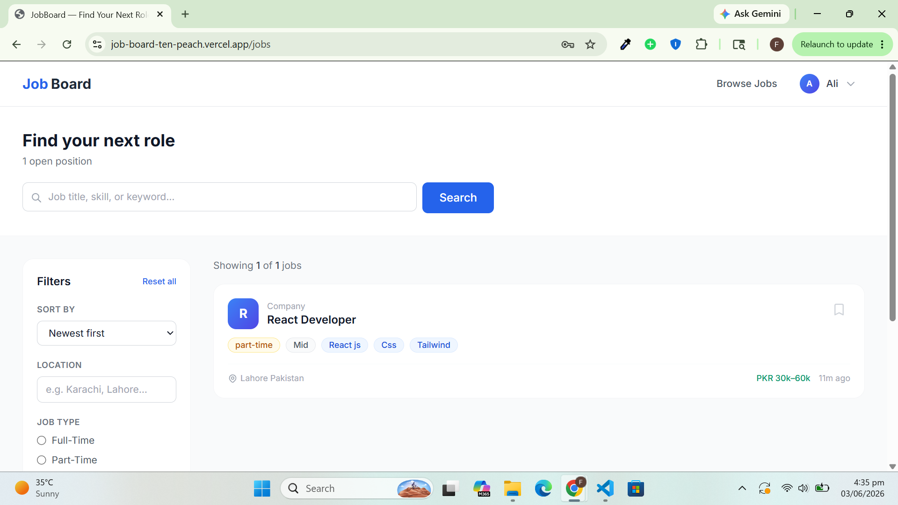
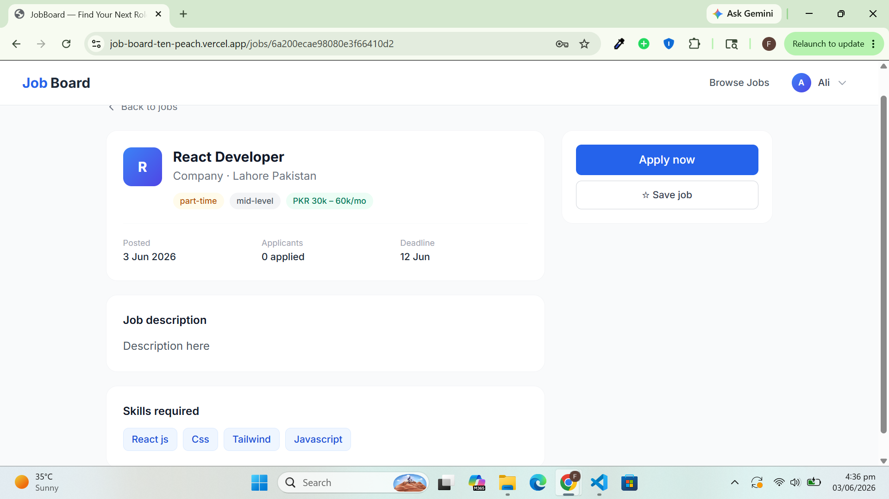
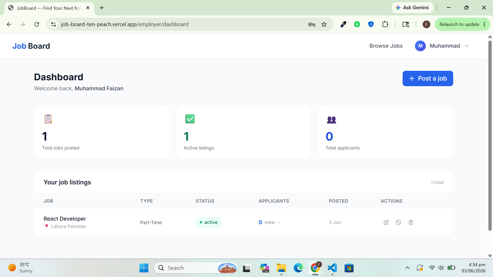
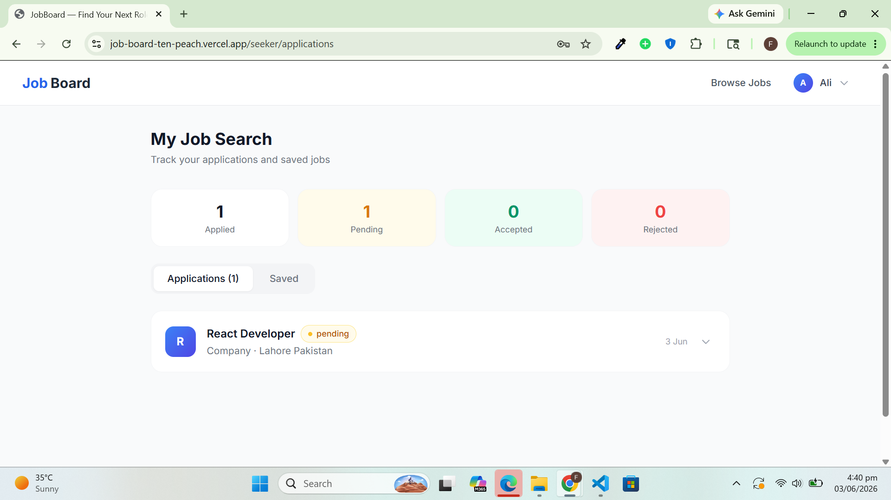

<div align="center">

# 🧑‍💼 JobBoard

**A full-stack job board built with the MERN stack**

[](https://react.dev)
[](https://nodejs.org)
[](https://expressjs.com)
[](https://mongodb.com/atlas)
[](https://tailwindcss.com)

[**Live Demo →**](https://job-board-ten-peach.vercel.app)
[**API →**](https://job-board-api-nk4k.onrender.com/api/health)

</div>

---

## 📸 Screenshots

## 📸 Screenshots

| Jobs Listing                    | Job Detail                                  |
| ------------------------------- | ------------------------------------------- |
|  |  |

| Employer Dashboard                                 | My Applications                                        |
| -------------------------------------------------- | ------------------------------------------------------ |
|  |  |

---

## ✨ Features

### For Job Seekers

- Browse, search, and filter job listings (by title, type, location, experience)
- Apply with cover letter and resume upload (PDF)
- Track application status: **pending → reviewed → accepted / rejected**
- Visual progress timeline per application
- Save and bookmark jobs for later
- Upload profile photo and default resume
- Edit bio and skills list

### For Employers

- Post, edit, and soft-delete job listings
- Set job type, experience level, salary range, deadline
- Toggle listings open/closed without deleting
- View all applicants per job in a slide-in panel
- Accept or reject with optional feedback note
- Email notification sent to applicant on status change

### Technical

- JWT authentication with role-based access control (`seeker` / `employer`)
- Passwords hashed with bcrypt
- NoSQL injection prevention with `express-mongo-sanitize`
- Rate limiting on all routes (stricter on auth)
- File uploads via Multer + Cloudinary (resumes + images)
- Email notifications via Nodemailer (Gmail)
- MongoDB text index for full-text job search
- Pagination on job listings
- Skeleton loaders, empty states, toast notifications

---

## 🛠 Tech Stack

| Layer            | Technology                                     |
| ---------------- | ---------------------------------------------- |
| **Frontend**     | React 18, React Router v6, Tailwind CSS, Axios |
| **Backend**      | Node.js, Express.js                            |
| **Database**     | MongoDB Atlas, Mongoose                        |
| **Auth**         | JSON Web Tokens (JWT), bcryptjs                |
| **File Storage** | Cloudinary                                     |
| **Email**        | Nodemailer (Gmail SMTP)                        |
| **Deployment**   | Vercel (frontend) + Render (backend)           |

---

## 🗂 Project Structure

```
job-board/
├── client/                         # React + Vite frontend
│   ├── public/
│   └── src/
│       ├── api/
│       │   ├── axios.js            # Axios instance + JWT interceptor
│       │   └── services/index.js   # All API call functions
│       ├── components/
│       │   ├── jobs/               # JobCard, JobForm, FilterSidebar,
│       │   │                       # Pagination, ApplicantsPanel, Skeletons
│       │   ├── layout/             # Navbar (with dropdown)
│       │   └── ui/                 # Modal, StatusBadge, ConfirmDialog
│       ├── context/
│       │   └── AuthContext.jsx     # Global auth state + login/register/logout
│       ├── hooks/
│       │   └── useJobs.js          # Search, filter, pagination state
│       └── pages/
│           ├── auth/               # Login, Register
│           ├── jobs/               # Jobs listing, Job detail + apply modal
│           ├── employer/           # Employer dashboard
│           └── seeker/             # Applications tracker, Profile editor
│
└── server/                         # Node.js + Express backend
    ├── config/
    │   ├── db.js                   # MongoDB connection
    │   └── cloudinary.js           # Multer + Cloudinary storage
    ├── controllers/
    │   ├── authController.js       # Register, login, profile update
    │   ├── jobController.js        # CRUD + search + save/unsave
    │   ├── applicationController.js# Apply, withdraw, status update
    │   ├── companyController.js    # Company profile CRUD
    │   └── userController.js       # Public profile, file uploads
    ├── middleware/
    │   ├── auth.js                 # JWT protect + role authorize
    │   └── errorHandler.js        # Global error handler
    ├── models/
    │   ├── User.js                 # Role: seeker | employer
    │   ├── Job.js                  # Text index, salary, skills
    │   ├── Application.js          # Status tracking, unique constraint
    │   └── Company.js
    ├── routes/                     # Express routers
    └── utils/
        ├── asyncHandler.js         # Wraps async controllers
        ├── generateToken.js        # JWT sign + send
        └── emailService.js         # Nodemailer templates
```

---

## 🚀 Local Setup

### Prerequisites

- Node.js 18+
- A [MongoDB Atlas](https://mongodb.com/atlas) account (free tier)
- A [Cloudinary](https://cloudinary.com) account (free tier)

### 1. Clone the repo

```bash
git clone https://github.com/your-username/job-board.git
cd job-board
```

### 2. Set up the server

```bash
cd server
npm install
cp .env.example .env
```

Fill in `server/.env`:

```env
PORT=5000
NODE_ENV=development
MONGO_URI=mongodb+srv://...
JWT_SECRET=any_long_random_string
JWT_EXPIRES_IN=7d
CLOUDINARY_CLOUD_NAME=...
CLOUDINARY_API_KEY=...
CLOUDINARY_API_SECRET=...
EMAIL_USER=your@gmail.com
EMAIL_PASS=your_gmail_app_password
CLIENT_URL=http://localhost:5173
```

```bash
npm run dev   # starts on :5000
```

### 3. Set up the client

```bash
cd ../client
npm install
npm run dev   # starts on :5173
```

The frontend proxies `/api` requests to `:5000` automatically via Vite config.

---

## 🌐 Deployment

### Backend → Render

1. Push to GitHub
2. Go to [render.com](https://render.com) → **New Web Service**
3. Connect your repo, set **Root Directory** to `server`
4. Build command: `npm install` | Start command: `npm start`
5. Add all environment variables from `.env.example` in the **Environment** tab
6. Deploy — (https://job-board-api-nk4k.onrender.com)

### Frontend → Vercel

1. Go to [vercel.com](https://vercel.com) → **New Project**
2. Import your repo, set **Root Directory** to `client`
3. Add one environment variable:
   ```
   VITE_API_URL = https://job-board-api-nk4k.onrender.com
   ```
4. Deploy — copy the live URL
5. 5. Go back to Render → add `CLIENT_URL = https://job-board-ten-peach.vercel.app`

### MongoDB Atlas — allow all IPs for Render

In Atlas → **Network Access** → add `0.0.0.0/0` (Render uses dynamic IPs on the free tier).

---

## 📡 API Reference

| Method | Endpoint                       | Auth     | Description                             |
| ------ | ------------------------------ | -------- | --------------------------------------- |
| POST   | `/api/auth/register`           | —        | Register (seeker or employer)           |
| POST   | `/api/auth/login`              | —        | Login, returns JWT                      |
| GET    | `/api/auth/me`                 | ✅       | Get current user                        |
| PUT    | `/api/auth/me`                 | ✅       | Update name/bio/skills                  |
| GET    | `/api/jobs`                    | —        | List jobs (search, filter, paginate)    |
| GET    | `/api/jobs/:id`                | —        | Single job detail                       |
| POST   | `/api/jobs`                    | employer | Create job                              |
| PUT    | `/api/jobs/:id`                | employer | Update own job                          |
| DELETE | `/api/jobs/:id`                | employer | Soft-delete own job                     |
| GET    | `/api/jobs/my-jobs`            | employer | Employer's own listings                 |
| PUT    | `/api/jobs/:id/save`           | seeker   | Toggle save job                         |
| POST   | `/api/applications/:jobId`     | seeker   | Apply (multipart: resume + coverLetter) |
| GET    | `/api/applications/my`         | seeker   | My applications                         |
| DELETE | `/api/applications/:id`        | seeker   | Withdraw application                    |
| GET    | `/api/applications/job/:jobId` | employer | Applicants for a job                    |
| PUT    | `/api/applications/:id/status` | employer | Update application status               |

---

## 👨‍💻 Author

**Muhammad Faizan**

[](https://muhammad-faizan-portfolio.vercel.app)
[](https://github.com/LazyProgrammer1502)

---

<div align="center">
  <sub>Built as a portfolio project to demonstrate full-stack MERN development</sub>
</div>
